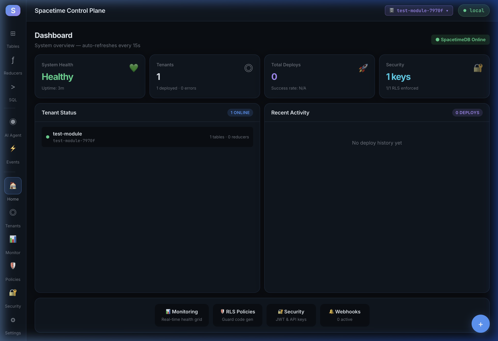
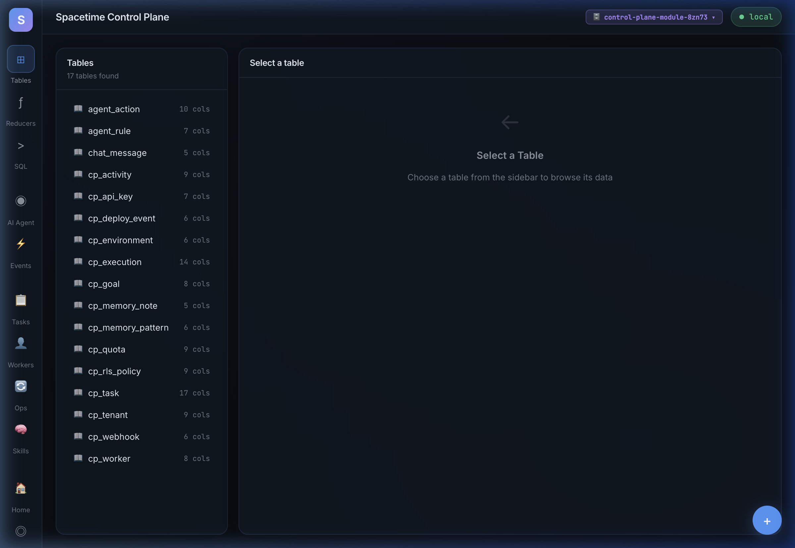
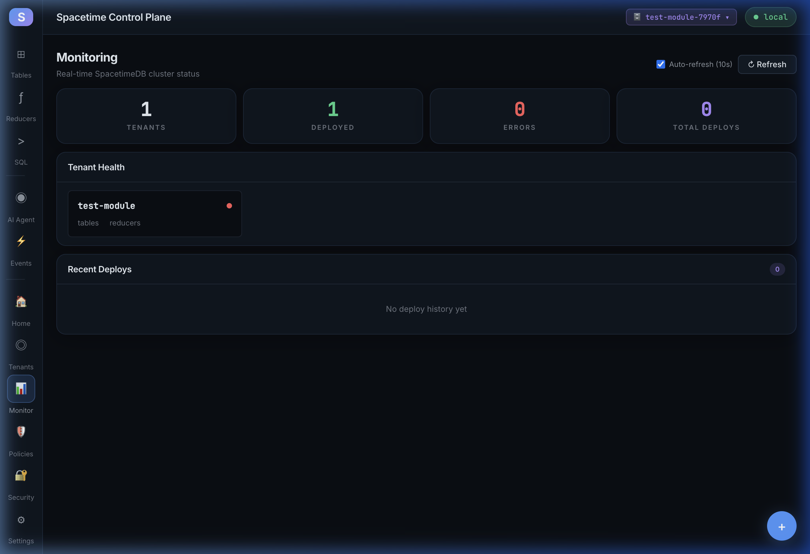
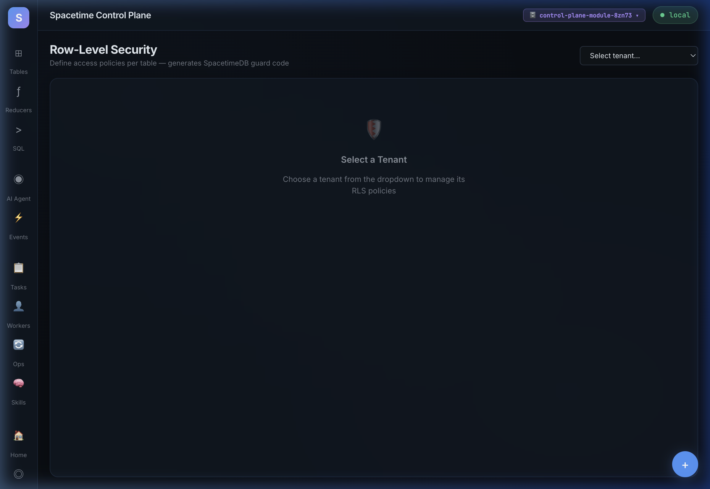
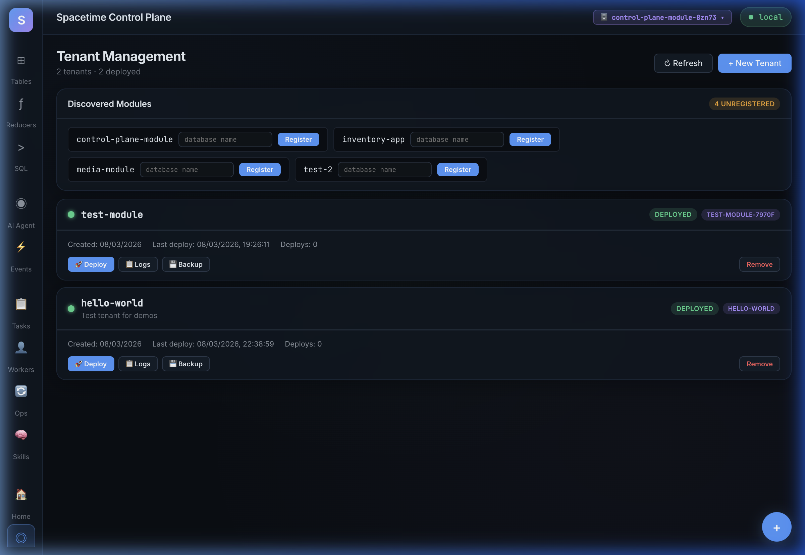
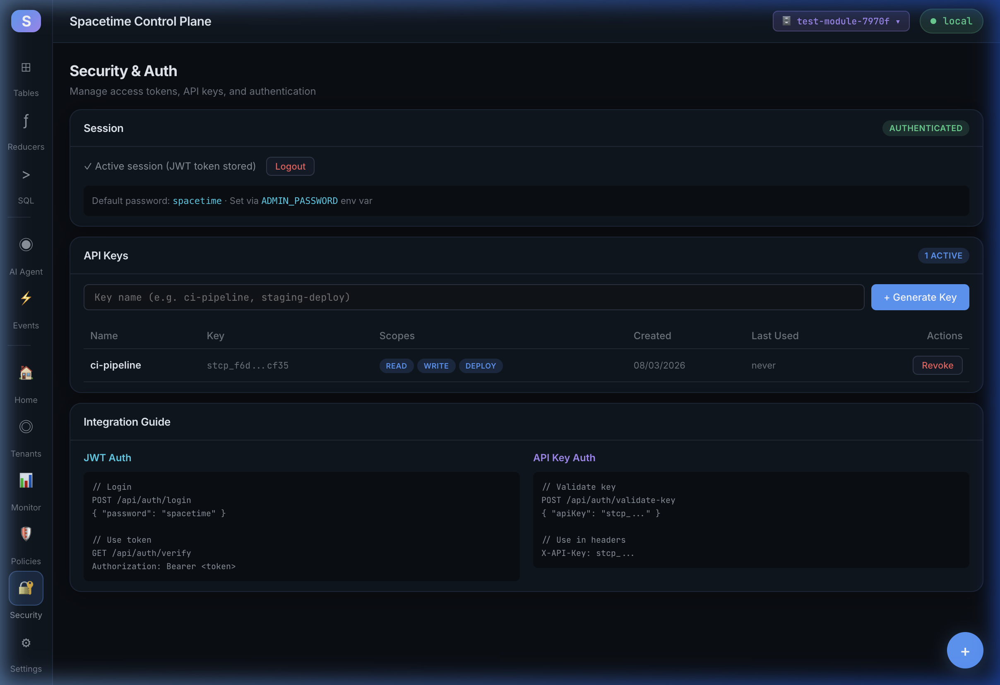
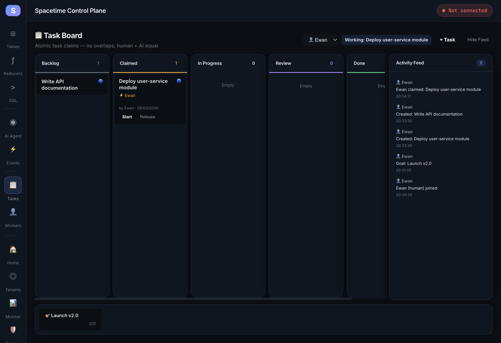
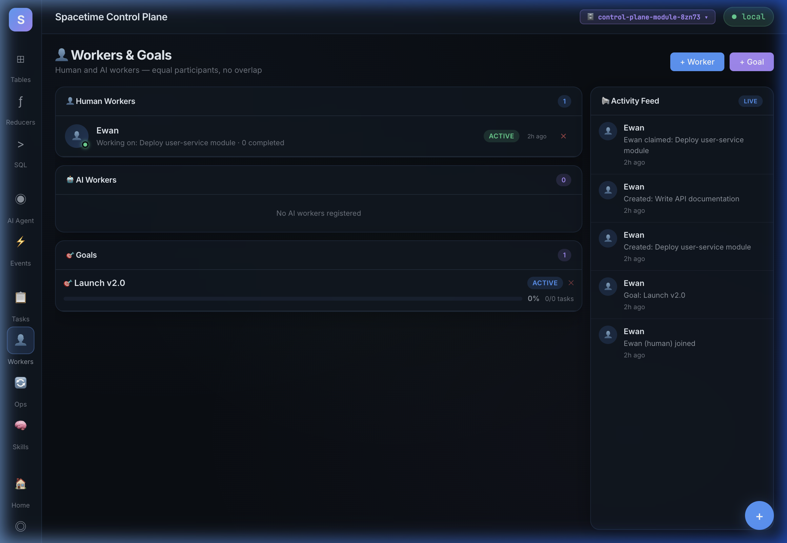
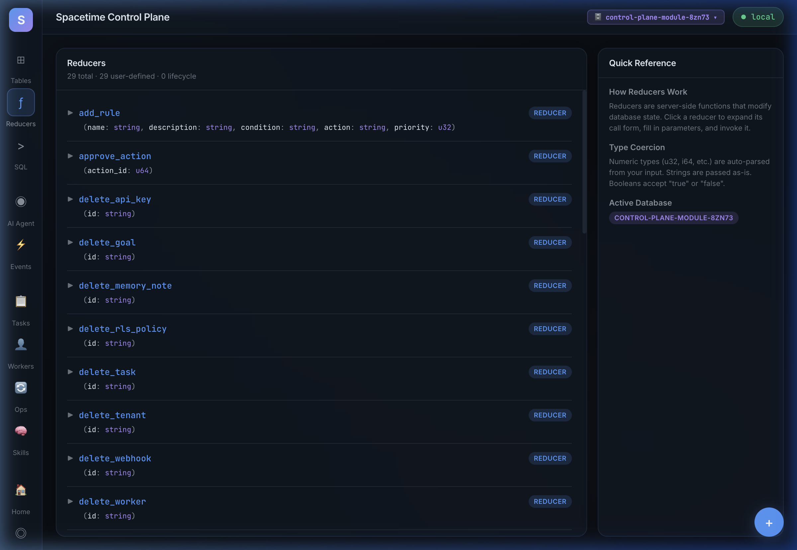
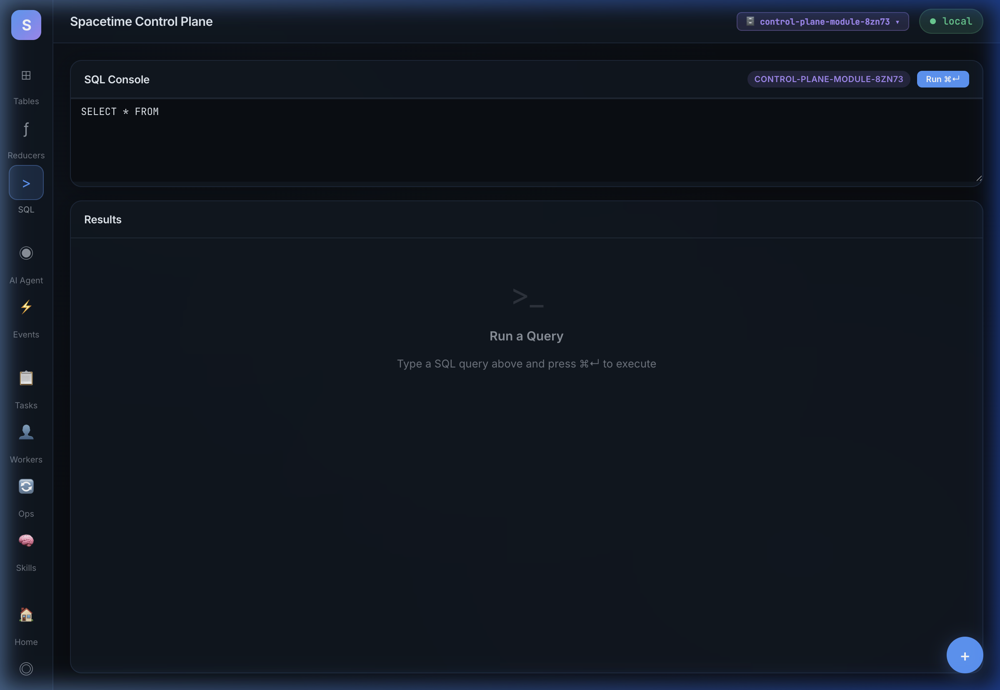

# Spacetime Control Plane

A **general-purpose visual control plane** for [SpacetimeDB](https://spacetimedb.com) — multi-tenant management, real-time monitoring, AI agent observability, row-level security, backup/restore, and full MCP integration.

> Think **Supabase Studio + Retool + AI observability** — but for SpacetimeDB.


> **🐕 Eats its own dogfood** — This control plane stores all its internal state (tenants, workers, tasks, API keys, RLS policies, quotas, memory, activity) in SpacetimeDB itself. No JSON files, no SQLite — just SpacetimeDB tables and reducers.

---

## 🖼️ Screenshots

### Dashboard
System health overview with stat cards, tenant status grid, deploy timeline, and quick links. Auto-refreshes every 15 seconds.



### Tables & Data Grid
Real-time table browser with live data grid, schema inspector, and auto-refresh. Click any table to explore rows and column types.



### Monitoring Dashboard
Real-time cluster health monitoring — tenant counts, deploy stats, error tracking, and per-tenant health grid with auto-refresh.



### Row-Level Security
Define per-table access policies and auto-generate TypeScript guard code for SpacetimeDB reducer modules.



### Tenant Management
Auto-discover SpacetimeDB modules, one-click deploy, log streaming, and backup/restore.



### Security & Auth
JWT session management, API key generation with scoped permissions, key revocation, and integration guide.



### Task Board
Kanban-style task management with atomic claims — no overlaps. Human and AI workers are equal participants. 5 columns: Backlog → Claimed → In Progress → Review → Done.



### Workers & Goals
Register human and AI workers as equal participants. Create goals, track progress automatically as tasks complete. Live activity feed shows all mutations.



<details>
<summary>More screenshots</summary>

### Reducers
Interactive reducer forms — view signatures, expand to fill typed parameters, invoke, and see success/error feedback.



### SQL Console
Write and execute SQL queries with results rendered as formatted tables.



</details>

---

## Features

### 🏠 Dashboard Home
- **System Health** — SpacetimeDB online/offline indicator with backend uptime
- **Stat Cards** — Tenants, deploys, security status at a glance
- **Tenant Grid** — Online/offline status per tenant with table/reducer counts
- **Deploy Timeline** — Recent deploy history with success/failure indicators
- **Quick Links** — Monitoring, RLS Policies, Security, Webhooks

### 📊 Schema Browser & Data Grid
- **Auto-discovery** — Connects to any SpacetimeDB module and introspects the schema at runtime
- **Live Data Grid** — Real-time table data with 3-second auto-refresh
- **Schema Inspector** — Column names, types, constraints (PK, auto_inc, unique)

### ⚡ Reducer Caller & SQL Console
- **Interactive Reducer Forms** — Click any reducer to expand a typed parameter form, invoke it, and see success/error feedback
- **SQL Console** — Write and execute SQL queries with results rendered as tables

### 🤖 AI Observability
- **Activity Feed** — Timeline of AI agent actions with approve/reject workflow
- **Rules Panel** — Human-editable rules that govern AI behavior
- **AI Chat** — Real-time conversation between humans and AI agents

### 👥 Tenant Management
- **Auto-Discovery** — Scans workspace for SpacetimeDB modules
- **One-Click Deploy** — Register modules and publish from the UI
- **Log Streaming** — View module logs (batch fetch + SSE streaming)
- **Backup & Restore** — Full data export per tenant, download/restore from JSON

### 📈 Monitoring
- **Aggregate Stats** — Tenants, deployed, errors, total deploys — real-time cards
- **Tenant Health Grid** — Online/offline status indicators per tenant
- **Deploy Timeline** — Recent deploys with ✓/✗ status
- **Auto-Refresh** — Polls every 10 seconds (toggleable)

### 🛡️ Row-Level Security
- **Policy Manager** — Define per-table, per-operation access policies
- **Enforcement Toggle** — Enable/disable policies without deleting them
- **Code Generation** — Auto-generates TypeScript guard functions + `enforceRLS` middleware
- **SpacetimeDB Compatible** — Generated code uses `ReducerContext.sender` identity checks

### 🔐 Security & Auth
- **JWT Sessions** — Login with admin password, 24-hour tokens
- **API Keys** — Generate `stcp_*` keys with scoped permissions (read/write/deploy)
- **Key Management** — Masked display, last-used tracking, one-click revoke

### 🔔 Webhooks
- **Event Subscriptions** — Register URLs for deploy/failure/tenant events
- **Test Delivery** — One-click webhook test
- **Toggle & Manage** — Enable/disable without deleting

### 🔌 MCP Server
- **15 MCP Tools** — Full SpacetimeDB + Control Plane access for AI agents
- **stdio Transport** — Drop-in local integration
- **Zero Config** — Just point it at your SpacetimeDB URL

---

## Architecture & Methodology

```
┌──────────────────────────────────────────────────────────────────┐
│                    Control Plane UI (12 pages)                    │
│  React 19 + TypeScript + Vite + Glassmorphism CSS                │
│                                                                   │
│  ┌──────┬──────┬─────┬──────┬──────┬───────┬───────┬──────────┐  │
│  │ Home │Tables│ SQL │Agent │Event │Tenant │Monitor│ Policies │  │
│  └──┬───┴──┬───┴──┬──┴──┬───┴──┬───┴───┬───┴───┬───┴────┬─────┘  │
│     └──────┴──────┴─────┴──────┴───────┴───────┴────────┘        │
│                           │                                       │
│  ┌────────────────────────▼──────────────────────────────────┐   │
│  │              Backend Service (:3002)                        │   │
│  │  Node.js + Express · 40+ REST endpoints                    │   │
│  │  Tenants · Deploy · Logs · Monitoring · Auth · Backup ·    │   │
│  │  Schema · RLS Policies · Files · Webhooks · Dashboard      │   │
│  └────────────────────────┬──────────────────────────────────┘   │
└───────────────────────────┼──────────────────────────────────────┘
                            │
          ┌─────────────────▼───────────────┐
          │       SpacetimeDB :3001         │
          │  ┌───────────────────────────┐  │
          │  │   App Module A            │  │
          │  │   App Module B            │  │
          │  │   Control Plane AI Module │  │
          │  └───────────────────────────┘  │
          └─────────────────▲───────────────┘
                            │
          ┌─────────────────┴───────────────┐
          │       MCP Server (stdio)        │
          │   15 tools for AI agents        │
          └─────────────────────────────────┘
```

### Design Principles

1. **Federation Layer** — The control plane sits above SpacetimeDB, managing multiple databases/modules as tenants. Each tenant is an independent SpacetimeDB module with its own schema, reducers, and data.

2. **Backend as Bridge** — The Express backend bridges the React UI and SpacetimeDB CLI/APIs. It handles tenant registration, deploy orchestration, log streaming, backup export, and policy management — things that SpacetimeDB doesn't natively support as a control plane.

3. **Code Generation over ORM** — RLS policies aren't enforced at the database level (SpacetimeDB doesn't support this natively). Instead, the control plane generates TypeScript guard functions that you paste into your reducer modules. This keeps enforcement explicit and auditable.

4. **MCP-First AI Integration** — Every backend capability is exposed as an MCP tool, making the control plane fully accessible to AI agents. The MCP server can list tenants, deploy modules, create backups, add RLS policies, and monitor health — all without the UI.

5. **Glassmorphism Design System** — Custom dark theme with glass blur effects, JetBrains Mono for code, Inter for UI text, and a curated accent palette (blue, green, amber, red, purple, cyan).

---

## Quick Start

### Prerequisites

- [Node.js](https://nodejs.org) 18+
- [SpacetimeDB CLI](https://spacetimedb.com/install) v2.0.3+

### 1. Start SpacetimeDB

```bash
spacetime start
```

### 2. Publish a Test Module

```bash
cd modules/test-module
cd spacetimedb && npm install && cd ..
spacetime publish test-module --server http://localhost:3001
```

### 3. Start the Control Plane

```bash
# Frontend (12 pages)
cd control-plane
npm install
npm run dev

# Backend (required for tenant management, monitoring, auth, backup, webhooks)
cd control-plane/backend
npm install
npm start
```

Open `http://localhost:5174` → Connect to your SpacetimeDB instance.

### 4. (Optional) Start the MCP Server

```bash
cd control-plane/mcp-server
npm install
SPACETIME_URL=http://localhost:3001 node index.js
```

---

## Pages

| Page | Icon | Description |
|------|------|-------------|
| **Dashboard** | 🏠 | System overview with stat cards and quick links |
| **Tables** | ⊞ | Live data grid with schema inspector |
| **Reducers** | ƒ | Interactive reducer forms |
| **SQL** | > | SQL console with markdown results |
| **AI Agent** | ◉ | Activity feed + rules panel |
| **Events** | ⚡ | AI chat with message bubbles |
| **Tenants** | ◎ | Module management, deploy, logs, backup |
| **Monitor** | 📊 | Real-time health grid + deploy timeline |
| **Policies** | 🛡️ | RLS policy manager with code generation |
| **Security** | 🔐 | JWT sessions + API key management |
| **Settings** | ⚙ | Topology graph + database overview |

## Backend API

| Category | Endpoints | Description |
|----------|-----------|-------------|
| **Dashboard** | GET overview | Aggregated system stats |
| **Tenants** | CRUD, register, discover | Manage tenant modules |
| **Deploy** | POST publish | One-click deploy via CLI |
| **Logs** | GET batch, SSE stream | Module log viewing |
| **Monitoring** | Overview, per-tenant stats | Real-time health data |
| **Schema** | Snapshot, diff | Migration tracking |
| **Auth** | Login, verify, key CRUD | JWT + API key auth |
| **Backup** | Create, list, download, restore | Full data export/import |
| **RLS** | Policy CRUD, codegen | Row-level security |
| **Files** | Upload, list | Media reference storage |
| **Webhooks** | CRUD, toggle, test | Event notifications |
| **System** | Health check | Backend status |

## MCP Tools

| Tool | Description |
|------|-------------|
| `spacetime_ping` | Check if SpacetimeDB is reachable |
| `spacetime_list_databases` | List all known databases with live stats |
| `spacetime_add_database` | Register a database name |
| `spacetime_get_schema` | Full schema (tables + reducers) as JSON |
| `spacetime_list_tables` | Table listing with column details |
| `spacetime_describe_table` | Detailed table info + sample rows |
| `spacetime_list_reducers` | Reducer signatures |
| `spacetime_query` | Run SQL, get markdown table results |
| `spacetime_call_reducer` | Call a reducer with JSON arguments |
| `cp_list_tenants` | List registered tenants with status |
| `cp_deploy_tenant` | Deploy a module to SpacetimeDB |
| `cp_monitoring_overview` | Aggregate stats for all tenants |
| `cp_backup_tenant` | Full data backup for a tenant |
| `cp_create_api_key` | Generate scoped API key |
| `cp_add_rls_policy` | Create row-level security policy |

### MCP Configuration

```json
{
  "mcpServers": {
    "spacetime": {
      "command": "node",
      "args": ["<path-to>/control-plane/mcp-server/index.js"],
      "env": {
        "SPACETIME_URL": "http://localhost:3001",
        "SPACETIME_DATABASES": "your-database-name"
      }
    }
  }
}
```

## Environment Variables

| Variable | Default | Description |
|----------|---------|-------------|
| `SPACETIME_URL` | `http://localhost:3001` | SpacetimeDB instance URL |
| `PORT` | `3002` | Backend service port |
| `ADMIN_PASSWORD` | `spacetime` | Admin login password |
| `JWT_SECRET` | auto-generated | JWT signing secret |
| `BACKEND_URL` | `http://localhost:3002` | MCP → backend URL |

## Project Structure

```
spacetime-control-plane/
├── control-plane/              # React + Vite frontend
│   ├── src/
│   │   ├── components/         # Sidebar, TopBar, ConnectDialog
│   │   ├── hooks/              # useConnection (multi-instance context)
│   │   ├── lib/                # SpacetimeDB HTTP client
│   │   ├── pages/              # 12 page components
│   │   └── test/               # Vitest setup
│   ├── backend/                # Express backend service
│   │   └── server.js           # 40+ REST endpoints
│   └── mcp-server/             # MCP server (Node.js, stdio)
│       └── index.js            # 15 tools + resources
│
├── modules/                    # SpacetimeDB server modules
│   ├── test-module/            # Simple person table + reducers
│   ├── inventory-app/          # Item + task tables with CRUD
│   └── control-plane-module/   # AI observability module
│
├── docs/screenshots/           # UI screenshots for documentation
└── README.md
```

## Testing

```bash
cd control-plane
npm test              # Run all tests
npm run test:watch    # Watch mode
npm run test:coverage # Coverage report
```

## Tech Stack

| Layer | Technology |
|-------|-----------|
| Frontend | React 19 + TypeScript + Vite |
| Styling | Vanilla CSS (glassmorphism design system) |
| Backend | Node.js + Express |
| Auth | JWT (jsonwebtoken) + API keys |
| Testing | Vitest + React Testing Library |
| Database | SpacetimeDB v2.0.3 |
| Modules | SpacetimeDB TypeScript SDK |
| MCP | @modelcontextprotocol/sdk (stdio) |

## Contributing

1. Fork the repository
2. Create a feature branch (`git checkout -b feature/my-feature`)
3. Commit your changes (`git commit -am 'Add my feature'`)
4. Push to the branch (`git push origin feature/my-feature`)
5. Open a Pull Request

## License

MIT License — see [LICENSE](LICENSE) for details.

## Credits

- [SpacetimeDB](https://spacetimedb.com) — The database engine
- [Model Context Protocol](https://modelcontextprotocol.io) — AI integration standard
- Built with ❤️ by [Ewan Richardson](https://github.com/WispAyr)
